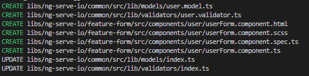

# @ngserveio/ws Nx Plugin

This library was generated with [Nx](https://nx.dev).

## Purpose
The purpose of the library is to quickly scaffold and create Angular Applications with certain opinions.

## Building

Run `nx build ng-starter` to build the library.

## Running unit tests

Run `nx test ng-starter` to execute the unit tests via [Jest](https://jestjs.io).

## Generators
| Name                  | Parameters                  | Description                                                                                                                                                                                                              |
| --------------------- | --------------------------- | ------------------------------------------------------------------------------------------------------------------------------------------------------------------------------------------------------------------------ |
| `api-app`             | `name`, `domain`            | Creates a NestJS application under the `apps/{domain}/{name}-api`                                                                                                                                                        |
| `api-feature`         | `name`, `domain`            | Creates a NestJS feature library for an api under `libs/{domain}/api/{name}-feature`                                                                                                                                     |
| `app-feature`         | `name`,`domain`             | Creates an Angular feature library under `libs/{domain}/ui/{name}-feature`                                                                                                                                               |
| `client-app`          | `name`, `domain`            | Creates a Angular app under `apps/{domain}/{name}-app`                                                                                                                                                                   |
| `common-domain-lib`   | `name`, `domain`            | Creates a common node library that can be shared safely between Angular and Nest Applications `libs/{domain}/common`                                                                                                     |
| `data-access` | `domain` | Creates a `data-access` library under a specified domain `libs/{domain}/ui/data-access` |
| `domain`              | `name`, `domain`            | Creates a number of libraries above                                                                                                                                                                                      |
| `firebase-ngrx-store` | `collection`, `domain`      | Scaffolds a store module in the `libs/{domain}/ui/data-access` library scaffolding the reducer, effects, actions for working with Firebase. Creates the model in the `common` library by the `collection` name provided. |
| `material-form`       | `name`, `project`, `inputs` | Creates a material form utilzing the `@ngserveio/material-forms` package for form fields, validation, and inputs     

### material-form generator

Creates a material form component, validator, and model.

The component associated with the `project` parameter. Based on the `project`, the `model` and `validator` for the form will fall under the `common` project for the domain.

Sample Command

```bash
nx workspace-generator material-form --name=user --project=ng-serve-io-feature-form --inputs="firstName:t,lastName:t,email:t,password:t"
```

Output

